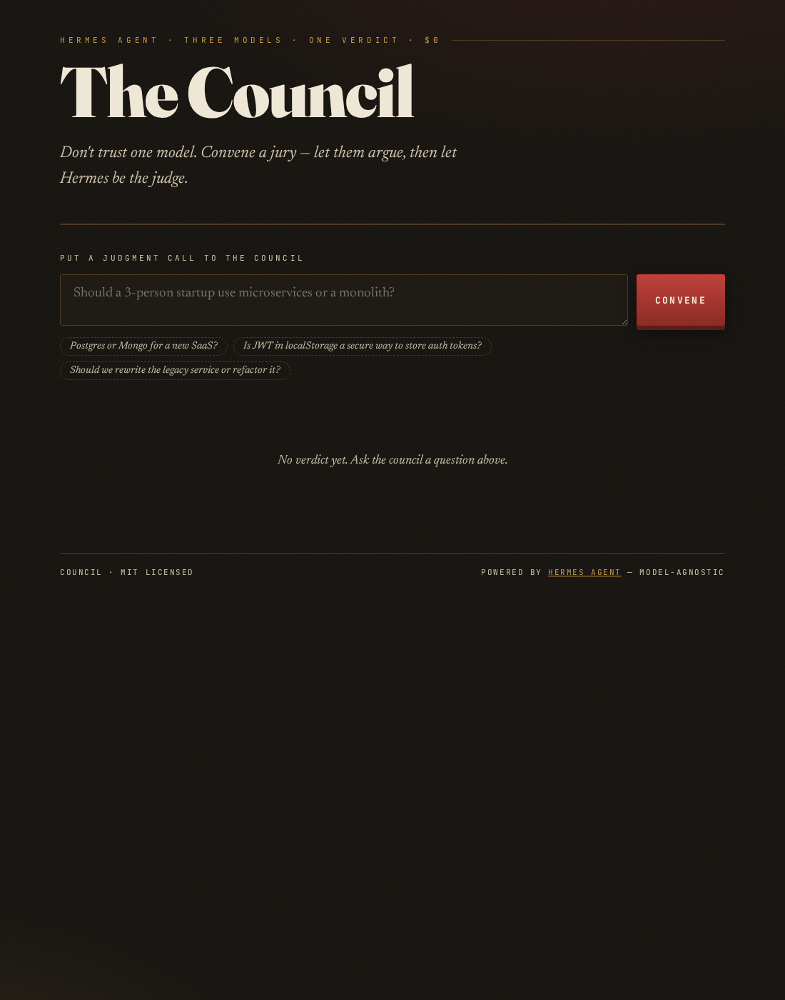
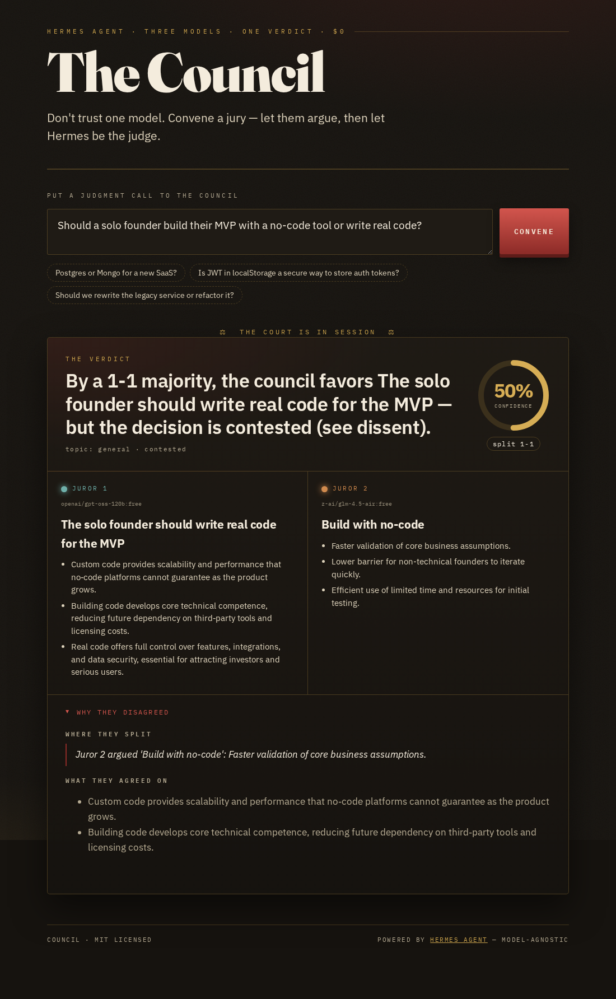

*This is a submission for the [Hermes Agent Challenge](https://dev.to/challenges/hermes-agent-2026-05-15): Build With Hermes Agent*

An LLM once talked me into the wrong database with total confidence. One smooth, authoritative answer. I shipped it. It cost me a weekend and a migration I'm still not over.

The villain here is **single-model overconfidence** — you get one polished reply, and the disagreement that should have warned you is invisible. You never see the other opinions, because you only asked one model.

**So I stopped trusting one model. I convened a jury.**

Council takes any judgment call — "Postgres or Mongo?", "is this PR safe to merge?", "is this clause risky?" — and asks **three different models**, lets them disagree, then has Hermes deliver one verdict, a confidence score, and exactly *why* they split. Three models, one verdict, $0.



**Repo:** https://github.com/ArqamWaheed/council *(MIT)* · **Live demo:** https://YOUR_DEMO

---

## What I Built

You ask a question. Council fans it out to three jurors — two free OpenRouter models from different families and one local model via Ollama — each takes a position with reasons. Hermes then judges: a single verdict, a **confidence score** (high when they agree, low when they split 2–1), and a "why they disagreed" panel. Every verdict is remembered, a `council` skill learns which juror to trust for which kind of question, and the agent can even **propose its own** trust adjustments for you to approve.


*The whole product is one question box. Everything interesting happens behind it — and the rest of this post is mostly pictures of that "behind."*

---

## Architecture, in pictures

I think the design is easiest to *see*, so here's the system as a sequence of images. Each caption is the explanation.


*The core loop. One question → three independent Hermes subagents (2 hosted + 1 local) fanned out in parallel → a fourth Hermes run (the foreman) synthesizes one verdict. Every arrow is the same `hermes -z` interface; nothing talks to a model directly.*


*The bet. A hosted model and an on-device model sit on the same jury, swapped with a single `--provider/--model` flag, no code change. This model-agnosticism is the one Hermes property the whole project is built on.*


*The UX surface. Confidence is high when jurors agree and drops on a 2–1 split. The dissent panel is collapsed by default — you expand it exactly when the confidence number makes you nervous.*


*The actual product. A confident single answer hides this; Council makes the disagreement the headline. Getting the clustering right here was subtle — see "What I learned" below.*


*The agentic learning loop, human-in-the-loop. Hermes proposes; you approve or dismiss. Approved rules persist client-side and ride along with the next convene call.*


*Persistence the judge can verify. Verdicts are mirrored into Hermes' own memory, so recall is Hermes doing the work — proof lives in `docs/hermes-proof/04-memory-recall.txt`.*

---

## Demo

Live: https://YOUR_DEMO — try "Should a 3-person startup use microservices?" and open the dissent panel.
Local, one command (runs at $0 in offline mock mode, no key needed):

```
git clone https://github.com/ArqamWaheed/council && cd council && ./setup_hermes.sh && python server.py
```

---

## Code

Repo: https://github.com/ArqamWaheed/council. Interesting files: `hermes_run.py` (the Hermes CLI driver every juror/judge call goes through), `run_council.py` (orchestration + the deterministic judge + Hermes foreman + the `--reflect` loop), `skills/council/SKILL.md` (the juror-weighting brain Hermes edits), `server.py` (the `/api/reflect` + `/api/learn` endpoints), `index.html` (the designed verdict UI with the foreman TTS readout and localStorage persistence). Proof that Hermes is genuinely in the loop — subagent transcripts, skill diff, memory recall — is in [`docs/hermes-proof/`](https://github.com/ArqamWaheed/council/tree/main/docs/hermes-proof).

```python
# hermes_run.py — every juror/judge call is a real Hermes run
def ask(prompt, provider, model, skills=None, timeout=120):
    cmd = [binary(), "--provider", provider, "--model", model]
    if skills: cmd += ["--skills", skills]
    cmd += ["-z", prompt]                       # -z = one-shot, final answer on stdout
    return subprocess.run(cmd, capture_output=True, text=True, timeout=timeout).stdout

# jurors.py — fan out one Hermes subagent per juror, in parallel
with ThreadPoolExecutor(max_workers=len(roster())) as pool:
    opinions = list(pool.map(lambda c: ask_juror(*c), enumerate(roster())))
```

---

## How I Used Hermes Agent

**Why Hermes at all — the model-agnostic core.** Hermes lets you point at any provider and swap with a flag, no code change. Council is built *on top of that one property*: the jurors are different models, and Hermes is the only piece that makes "different models" cheap. The clearest proof is the third juror — it runs **locally** via Ollama while the other two are **hosted** on OpenRouter, and all three answer through the exact same `hermes -z` interface (the model-agnostic diagram above). A hosted model and an on-device model, sitting on the same jury, no code change: that's model-agnosticism you can see. I genuinely didn't see another entry in this challenge exploit it — everyone picked one model and moved on. That's the whole bet.

**Subagents — one real Hermes run per juror.** Each juror is a genuine, isolated Hermes invocation on a *different* provider+model (`hermes -z --provider openrouter --model …` for the two hosted jurors, `--provider ollama-local …` for the on-device one), fanned out **in parallel** so no model's reasoning anchors another's (the convene-flow diagram above). Hermes does the inference; my Python (`jurors.py` → `hermes_run.py`) is just the fan-out plumbing, and every juror in the output JSON is tagged `"via": "hermes"`. The gotcha worth flagging: Hermes enforces a **64K-context floor**, which for the local model meant setting both `ollama_num_ctx` *and* a named `custom_providers` entry — without the named provider, `--provider ollama` silently routed to the wrong base URL. `setup_hermes.sh` encodes the working config so a judge can reproduce it in one command.

**Why a skill, not a prompt, for judging.** The foreman's verdict is itself a Hermes run — `hermes -z --skills council` — grounded in `skills/council/SKILL.md`, which is **installed into Hermes** (`hermes skills list` shows it). The weighting logic lives in a machine-readable `weights` block.


*The judging brain is data, not a buried prompt. `--learn` and `--reflect` both edit this block, and the installed Hermes copy is kept in sync.*

After a string of security questions, `--learn` appended a rule to upweight the local model on that topic — *and synced the installed Hermes copy* — because it had caught issues the hosted models missed:

```
python run_council.py --learn "Local Juror | security | 1.5"
```

On the next security question that juror's vote counts 1.5×, read straight back by the judge. Counterfactual: a static synthesis prompt can't get better; this does. (The before/after skill diff is in [`docs/hermes-proof/03-skill-learning.txt`](https://github.com/ArqamWaheed/council/blob/main/docs/hermes-proof/03-skill-learning.txt).)

**Letting the agent propose its own learning — now on the web, and grounded in evidence.** `python run_council.py --reflect` (and the **"Should the council reweight itself?"** button in the UI) hands Hermes its *own* memory of past verdicts and asks it to propose one weight change — e.g. "the local juror has dissented on three database calls; upweight it." The key fix this round: the proposal is **evidence-grounded** — Hermes is fed the actual dissent tally and any rule backed by fewer than two real dissents is rejected, so it can't just parrot the example baked into the skill. You then **Approve or Dismiss** it (the reflect-flow diagram above). That's the agentic loop done honestly: a single verdict has no ground truth, so the agent surfaces a *pattern* and a human confirms it's signal, not overfitting — the exact tension this post closes on. (Offline, it falls back to a deterministic heuristic so it never breaks.)

**Making learning survive a stateless deploy.** On a hosted demo the filesystem is read-only, so an approved rule can't be written back to `SKILL.md`. Council handles this honestly: approved rules are stored in the browser's **localStorage** and re-sent with every `/api/convene` call, where they're merged into the judge's weights for that request. Locally you get a persistent `SKILL.md`; on the web you get per-browser persistence — either way the learning sticks.

**Why memory.** Each verdict is appended to a log *and mirrored into Hermes' own `MEMORY.md`*, so I can ask `hermes -z "what did the council decide about auth?"` and Hermes recalls it from its memory — not from my code (the memory-recall image above). Proof: [`docs/hermes-proof/04-memory-recall.txt`](https://github.com/ArqamWaheed/council/blob/main/docs/hermes-proof/04-memory-recall.txt).

**The foreman reads the verdict aloud.** The verdict card has a "the foreman reads the verdict" button (browser SpeechSynthesis, $0); Hermes also ships native TTS via `hermes setup tts`. On-theme and memorable — a jury foreman *announcing* the decision.

**The build itself was agent-run.** I kept a `memory.md` the coding agent read before each task and updated after (so context stayed cheap), committed every increment with Conventional Commits, and built the verdict UI with the **frontend-design** skill — which is why the confidence dial and colour-coded juror chips read as *designed*, not default-template AI slop. The repo's `AGENTS.md` + commit history show the process, not just the result.

**Why these models, and the concession.** Two free OpenRouter models from different families (≥64K context — Hermes rejects smaller at startup) plus a local Ollama juror. Two honest concessions: (1) free models are slower and three calls add latency (~10–20s/verdict); (2) the free tier is *aggressively* rate-limited — I hit 429s constantly while building, so Council retries and, if a juror still won't answer, falls back (Hermes → direct API → deterministic stand-in) rather than crashing the verdict, which also means the demo runs **fully offline at $0**. For a once-a-decision tool, I'll take it. Cost: $0.

**License.** MIT — fork it, add your own jurors.

---

## What I learned (and what's next)

- **The disagreement is the product.** A 2–1 split is *more* useful than a confident single answer — so the clustering that decides "who actually disagreed" has to be right. A small local model once wrote a vague position ("to facilitate efficient integration…") whose *reasons* clearly endorsed Postgres; the first version mis-filed it as a dissenter. The fix: when a juror's stated position is ambiguous, fall back to reading its reasons, and ignore options only mentioned in a comparison ("better *than* Mongo" isn't a vote for Mongo). Now agreeing jurors cluster together, and the split count is honest.
- **Grounded beats glib.** Letting the agent propose its own weighting only works if the proposal is tied to real evidence; an ungrounded "reflect" just echoes whatever example is in the skill.
- Hermes' 64K-context floor caught a model that would've quietly underperformed.
- Next: let jurors see each other's first answers for a real second round (true debate).

One question for you: **I weight a *local* model higher on security after it out-caught the hosted ones — but that's one user's anecdote turning into a rule. How would you decide when an agent's self-learned weighting is signal vs. overfitting?**

---

*Built for the Hermes Agent Challenge. MIT licensed. Repo, live demo, and the self-written skill diff are all in the README.*
